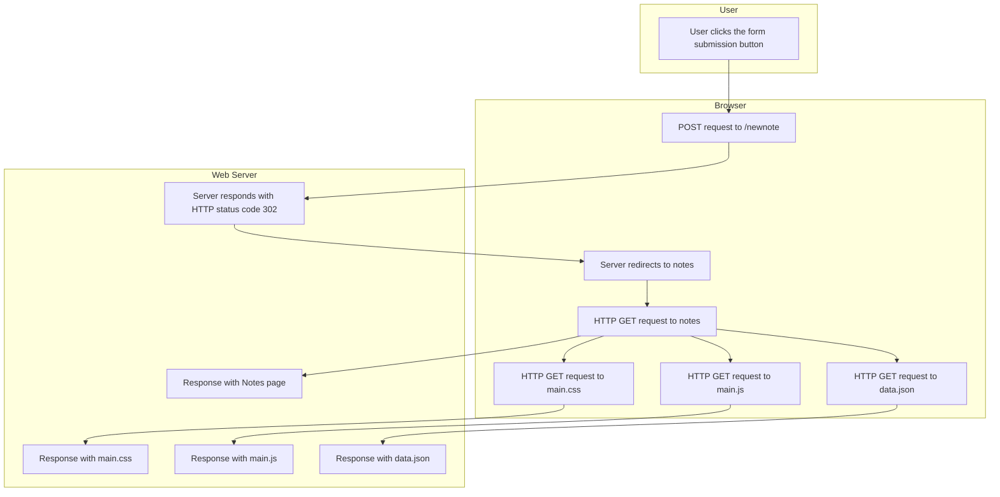

```mermaid
graph TD
    subgraph User
        A[User clicks the form submission button]
    end
    subgraph Browser
        B[POST request to /newnote]
        C[Server redirects to notes]
        D[HTTP GET request to notes]
        E[HTTP GET request to main.css]
        F[HTTP GET request to main.js]
        G[HTTP GET request to data.json]
    end
    subgraph Web Server
        H[Server responds with HTTP status code 302]
        I[Response with Notes page]
        J[Response with main.css]
        K[Response with main.js]
        L[Response with data.json]
    end
    A-->B
    B-->H
    H-->C
    C-->D
    D-->I
    D-->E
    D-->F
    D-->G
    E-->J
    F-->K
    G-->L
```