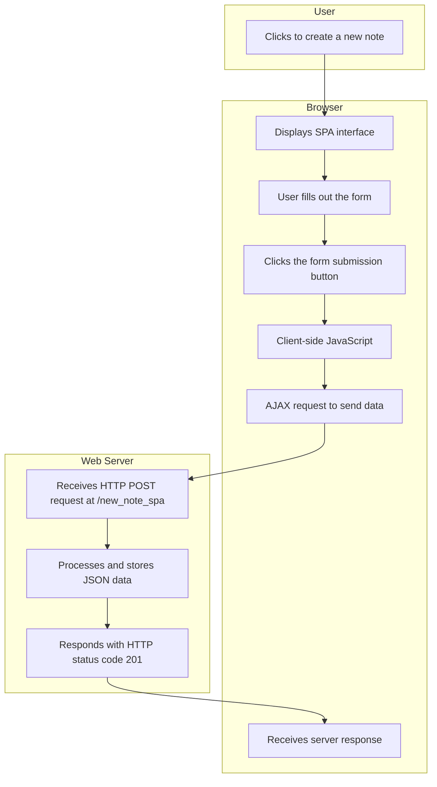

```mermaid
graph TD
    subgraph User
        A[Clicks to create a new note]
    end
    subgraph Browser
        B[Displays SPA interface]
        C[User fills out the form]
        D[Clicks the form submission button]
        E[Client-side JavaScript]
        F[AJAX request to send data]
        G[Receives server response]
    end
    subgraph Web Server
        H[Receives HTTP POST request at /new_note_spa]
        I[Processes and stores JSON data]
        J[Responds with HTTP status code 201]
    end
    A-->B
    B-->C
    C-->D
    D-->E
    E-->F
    F-->H
    H-->I
    I-->J
    J-->G

```