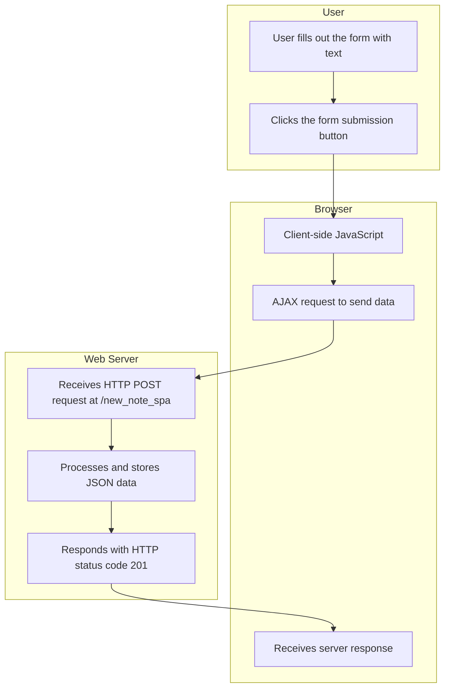

```mermaid
graph TD
    subgraph User
        A[User fills out the form with text]
        B[Clicks the form submission button]
    end
    subgraph Browser
        C[Client-side JavaScript]
        D[AJAX request to send data]
        E[Receives server response]
    end
    subgraph Web Server
        F[Receives HTTP POST request at /new_note_spa]
        G[Processes and stores JSON data]
        H[Responds with HTTP status code 201]
    end
    A-->B
    B-->C
    C-->D
    D-->F
    F-->G
    G-->H
    H-->E
```